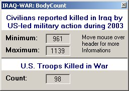



## IRAQ BodyCount \(really downloading \*g\*\) // now show U\.S\. Troops killed in War

### Description

Yesterday i've seen a code on PSC that "reads" the IRAQ bodycount. So i've decided to programm this little software. This software really reads the minimum and the maximum IRQA bodycount from the website www.iraqbodycount.net. Autoupdate every Minute.

NEW:

Now you can see the US Troops Killed in War

I HATE WAR, LET'S START WITH PEACE ON EARTH
 
### More Info
 

             |
---                |---
**Submitted On**   |2003-04-09 04:40:04
**By**             |[borisbuehler](https://github.com/Planet-Source-Code/PSCIndex/blob/master/ByAuthor/borisbuehler.md)
**Level**          |Intermediate
**User Rating**    |2.2 (22 globes from 10 users)
**Compatibility**  |VB 6\.0
**Category**       |[Internet/ HTML](https://github.com/Planet-Source-Code/PSCIndex/blob/master/ByCategory/internet-html__1-34.md)
**World**          |[Visual Basic](https://github.com/Planet-Source-Code/PSCIndex/blob/master/ByWorld/visual-basic.md)
**Archive File**   |[IRAQ\_BodyC157137492003\.zip](https://github.com/Planet-Source-Code/borisbuehler-iraq-bodycount-really-downloading-g-now-show-u-s-troops-killed-in-war__1-44586/archive/master.zip)

